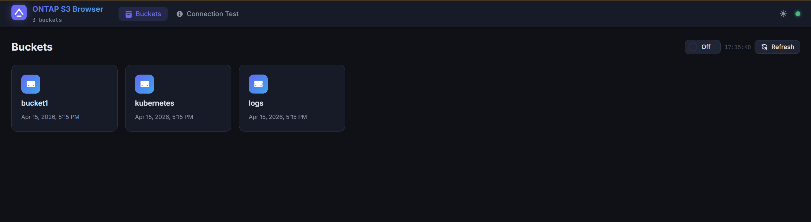
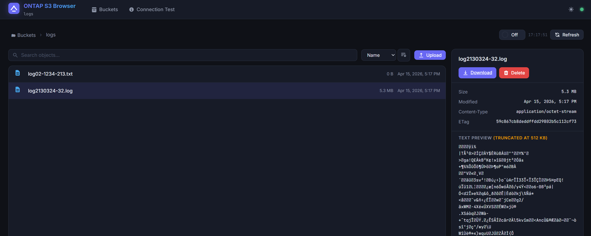
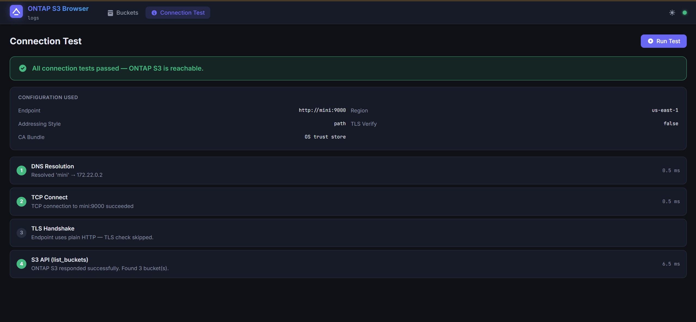

# ontap-s3-browser

A self-hosted web UI for browsing, previewing, and managing objects on **NetApp ONTAP S3** — designed for air-gapped and internal environments where standard S3 tools break.

> **Read-only by default.** Uploads and deletes are disabled unless explicitly enabled.

## Features

- **Browse & search** — Navigate buckets and folders, search objects, sort by name/size/date
- **File preview** — Inline preview for text, JSON, images, PDFs, and video (MP4/WebM)
- **Upload & delete** — Optional write operations, gated by feature flags
- **Bucket permissions** — Automatically detects which buckets you can access and groups inaccessible ones separately
- **Bucket lifecycle rules** — View, add, edit and delete S3 expiration rules (ONTAP 9.13.1+) with a version-aware banner that explains why it does not work on older versions
- **Connection diagnostics** — Step-by-step probe (DNS → TCP → TLS → S3 API) with detailed error messages
- **Deep linking** — Bookmark or share direct URLs to any bucket/folder; full SPA routing with browser back/forward
- **Dark & light themes** — Toggle between dark and light mode
- **Auto-refresh** — Optional interval (with countdown ring) while viewing objects inside a bucket; the bucket list uses manual refresh only
- **Offline-friendly** — No external CDN dependencies; works fully air-gapped
- **Restricted bucket mode** — Lock the instance to a single bucket via the endpoint URL

## Preview

**Dashboard**


**Bucket List**


**Connection Diagnostics**


---

## Quick Start (Pre-built Image) ⚡

**Fastest way to get running.** No build required — pull the pre-built image from GitHub Container Registry.

### Using Docker Compose (Recommended)

```bash
# 1. Clone the repo (for .env.example and docker-compose.yml)
git clone https://github.com/yosefcohen877/ontap-s3-browser.git
cd ontap-s3-browser

# 2. Configure your environment
cp .env.example .env
# Edit .env with your ONTAP S3 credentials and endpoint

# 3. Run with pre-built image
docker compose up -d

# 4. Open your browser
open http://localhost:8080
```

### Using Docker Run

```bash
# 1. Create .env file
cp .env.example .env
# Edit .env with your ONTAP S3 credentials

# 2. Run the container
docker run -d \
  --name ontap-s3-browser \
  -p 8080:8080 \
  --env-file .env \
  ghcr.io/yosefcohen877/ontap-s3-browser:latest

# 3. Open your browser to http://localhost:8080
```

### Version Tags

- `latest` — Always the most recent build from main branch (recommended)
- `v1.0.0` — Specific release versions (when available)
- `main` — Same as latest

### Troubleshooting

**Container won't start?**
- Verify `.env` has correct ONTAP S3 credentials
- Check logs: `docker logs ontap-s3-browser`
- Ensure port 8080 is available

**Update to latest version:**
```bash
docker stop ontap-s3-browser && docker rm ontap-s3-browser
docker pull ghcr.io/yosefcohen877/ontap-s3-browser:latest
docker compose up -d  # or docker run (see above)
```

---

## Building from Source

For development or if you want to customize the build.

```bash
# 1. Clone and enter the project
git clone https://github.com/yosefcohen877/ontap-s3-browser.git
cd ontap-s3-browser

# 2. Configure your environment
cp .env.example .env
# Edit .env with your ONTAP S3 credentials and endpoint

# 3. (Optional) Add internal CA certificates
# If your ONTAP S3 uses a self-signed or internal CA certificate:
#   a. Copy your .crt or .pem files into the ./certs/ directory
#   b. Uncomment the COPY and RUN lines in the Dockerfile
#   c. They will be automatically imported into the container's trust store

# 4. Build and run (uses docker-compose.build.yml)
docker compose -f docker-compose.build.yml up --build -d

# 5. Open your browser
open http://localhost:8080
```

### Why Build from Source?
- Customize the Dockerfile for your environment
- Add or modify features
- Pin specific Python package versions
- Local testing before pushing changes

---

## Development (without Docker)

Quick local development setup:

```bash
python3 -m venv venv
source venv/bin/activate  # Windows: venv\Scripts\activate
pip install -r requirements.txt
cp .env.example .env
# Edit .env
uvicorn app.main:app --reload --port 8080
```

Open http://localhost:8080

### Seeding Test Data

A helper script is included to bulk-upload test files for development and testing.

```bash
# Set up a virtual environment (if you haven't already)
python3 -m venv venv
source venv/bin/activate  # Windows: venv\Scripts\activate
pip install -r requirements.txt

# Upload 50 test files to the first accessible bucket
python3 scripts/seed_test_data.py

# Upload 200 files to a specific bucket and folder
python3 scripts/seed_test_data.py --bucket my-bucket --prefix logs/2024/ --count 200

# Larger files (10 KB each) with more parallelism
python3 scripts/seed_test_data.py --count 100 --size 10 --workers 8

# Clean up all test files when done
python3 scripts/seed_test_data.py --cleanup
python3 scripts/seed_test_data.py --bucket my-bucket --prefix logs/2024/ --cleanup
```

The script generates a mix of file types (JSON, CSV, Markdown, XML, binary) and places them under a `__test-seed__/` prefix for easy cleanup. It reads credentials from your `.env` file automatically.

---

## Configuration

All settings are in `.env`. Key variables:

| Variable | Required | Description |
|---|---|---|
| `S3_ACCESS_KEY_ID` | ✅ | ONTAP S3 access key |
| `S3_SECRET_ACCESS_KEY` | ✅ | ONTAP S3 secret key |
| `S3_ENDPOINT_URL` | ✅ | e.g. `https://ontap-s3` |
| `WEB_PASSWORD` | ✅ | UI login password |
| `S3_REGION` | — | Region (default: `us-east-1`) |
| `S3_CA_BUNDLE` | — | Path to CA bundle inside container |
| `S3_VERIFY_SSL` | — | `false` to skip TLS verification (testing only) |
| `S3_ADDRESSING_STYLE` | — | `path` (default, required for ONTAP) |
| `S3_MAX_POOL_CONNECTIONS` | — | `5` (conservative for ONTAP TLS limits) |
| `S3_CONNECT_TIMEOUT` | — | `10` (TCP connection timeout) |
| `S3_READ_TIMEOUT` | — | `30` (response data timeout) |
| `APP_PORT` | — | `8080` |
| `LOG_LEVEL` | — | `INFO` |
| `WEB_USERNAME` | — | `admin` |
| `ENABLE_UPLOAD` | — | `false` (read-only by default) |
| `ENABLE_DELETE` | — | `false` (read-only by default) |
| `ENABLE_CREATE_BUCKET` | — | `false` (read-only by default) |
| `ENABLE_DELETE_BUCKET` | — | `false` (allow empty-bucket deletion from the UI) |
| `ENABLE_BUCKET_COUNT` | — | `true` (show file count per bucket; disable for large buckets) |
| `ENABLE_BUCKET_LIFECYCLE` | — | `false` (allow add/edit/delete of expiration rules; requires ONTAP 9.13.1+) |
| `ENABLE_OBJECT_TAGGING` | — | `true` (allow viewing/editing S3 object tags in the UI; set `false` to hide tag actions) |

See `.env.example` for all options with documentation.

## Deployment Modes

### 1. Standard Mode (All Buckets)
Default behavior. Set `S3_ENDPOINT_URL` to just the host (e.g. `https://ontap-s3`). Upon logging in, users will see a grid of all available buckets ("Cubes").

### 2. Restricted Bucket Mode (Lockdown) 🔒
To deploy a dedicated instance for a single bucket:
```bash
# In .env
S3_ENDPOINT_URL=https://ontap-s3/my-special-bucket
```
In this mode, the application will:
- **Auto-Jump**: Skip the bucket list and go straight to the files.
- **Strict Enforcement**: Block any API requests for other buckets (403 Forbidden).
- **Diagnostics**: The connection test will specifically probe accessibility of that bucket.

---

## Bucket Lifecycle Rules

Each bucket card in the UI shows a **Lifecycle** action (hover to reveal) that opens a rules manager similar to [S3 Browser](https://s3browser.com/bucket-lifecycle-configuration.aspx). Rules are managed via the standard S3 API (`PutBucketLifecycleConfiguration` / `GetBucketLifecycleConfiguration` / `DeleteBucketLifecycle`) using **the same ONTAP S3 access key** — no extra ONTAP admin credentials required.

### What you can configure per rule

- **Filter** — prefix, object tags (logical AND), size greater/less than
- **Current versions** — expire after N days, or on a specific date, or remove expired delete markers
- **Noncurrent versions** — delete noncurrent versions after N days, optionally retaining the newest N
- **Other** — abort incomplete multipart uploads after N days

### ONTAP version compatibility

| ONTAP version | Lifecycle via S3 API | Notes |
|---|---|---|
| 9.8 – 9.10.1 | ❌ Not supported | No S3 lifecycle support at all |
| 9.11.1 / 9.12.1 | ❌ Not supported | S3 API for buckets/objects exists but lifecycle rules are not yet available |
| 9.13.1+ | ✅ Supported | Full S3 API CRUD (expiration actions only) |
| 9.14.1+ | ✅ Supported | Also manageable via ONTAP System Manager |

On unsupported versions the UI opens normally but shows a banner explaining the requirement. No errors, no extra configuration needed — once you upgrade ONTAP the feature starts working.

### Not supported by ONTAP (intentionally omitted from the UI)

- Storage-class transitions (`STANDARD_IA`, `ONEZONE_IA`, `INTELLIGENT_TIERING`, `GLACIER`, `DEEP_ARCHIVE`) — these are AWS-only storage tiers and ONTAP does not support them at any version.
- S3 lifecycle on S3-NAS (multiprotocol) buckets or MetroCluster configurations — disallowed by ONTAP itself.

### Enabling mutations

Reading rules is always allowed. To enable Add / Edit / Delete, set in `.env`:

```env
ENABLE_BUCKET_LIFECYCLE=true
```

Sources: [NetApp ONTAP S3 supported actions](https://docs.netapp.com/us-en/ontap/s3-config/ontap-s3-supported-actions-reference.html), [TR-4814 S3 in ONTAP Best Practices](https://download.lenovo.com/storage/s3_in_ontap_best_practices.pdf).

---

## Deep Linking & SPA Routing

The browser now behaves as a Single Page Application. You can bookmark specific locations or share direct links with teammates:

- `http://localhost:8080/my-bucket`
- `http://localhost:8080/my-bucket/logs/2024/`

The application handles these URLs automatically, navigating to the correct path on startup and keeping the address bar in sync as you browse. The **Back** and **Forward** buttons in your browser are fully supported.

---

## Project Structure

```
ontap-s3-browser/
├── .env                    ← Runtime configuration (gitignored)
├── .env.example            ← Configuration template
├── .gitignore              ← Git ignore rules
├── app/
│   ├── __init__.py
│   ├── main.py              ← FastAPI app factory + startup
│   ├── config.py            ← All env vars (pydantic-settings)
│   ├── s3_client.py         ← boto3 client factory (ONTAP-compatible)
│   ├── auth.py              ← HTTP Basic auth dependency
│   ├── routers/
│   │   ├── __init__.py
│   │   ├── buckets.py       ← GET /api/buckets, POST/DELETE /api/bucket
│   │   ├── objects.py       ← GET /api/objects, /meta, /download
│   │   ├── preview.py       ← GET /api/object/preview
│   │   ├── lifecycle.py     ← GET/PUT/DELETE /api/bucket/{b}/lifecycle
│   │   └── diagnostics.py   ← GET /api/health, /api/test-connection
│   └── utils/
│       ├── __init__.py
│       ├── logging.py       ← Structured JSON logging (structlog)
│       └── errors.py        ← ONTAP exception classification
├── frontend/
│   ├── index.html           ← SPA shell
│   ├── css/style.css        ← Dark-mode design system
│   └── js/
│       ├── api.js           ← Fetch wrapper + error parsing
│       ├── app.js           ← Theme, routing, toasts, helpers
│       ├── buckets.js       ← Bucket grid view
│       ├── browser.js       ← Object browser + detail pane
│       ├── preview.js       ← Text/JSON/image/PDF/video preview
│       ├── lifecycle.js     ← Bucket lifecycle rules modal
│       └── diagnostics.js   ← Connection test view
├── certs/                   ← Drop custom CA .crt files here
│   ├── .gitignore           ← Ignore cert files
│   └── README.md            ← Certificate setup instructions
├── scripts/
│   └── seed_test_data.py    ← Bulk-upload test files for development
├── Dockerfile               ← Multi-stage container build
├── docker-compose.yml       ← Pull pre-built image (recommended)
├── docker-compose.build.yml ← Build from source (developers)
├── README.md                ← This file
└── requirements.txt         ← Python dependencies
```

---

## ONTAP S3 Compatibility

This app is built around four pillars:

### 1. Path-style addressing (always forced)
```python
Config(s3={"addressing_style": "path"})
```
Virtual-style addressing (`bucket.hostname`) breaks with ONTAP S3. Path-style (`hostname/bucket`) is always used.

### 2. SigV4 signature (always forced)
```python
Config(signature_version="s3v4")
```
ONTAP S3 requires AWS Signature Version 4.

### 3. Conservative connection pool
```python
Config(max_pool_connections=5)
```
ONTAP has a finite TLS handshake capacity. Default AWS settings (10+ connections) can overwhelm it under concurrency.

### 4. Custom endpoint, custom CA, optional TLS bypass
The TLS verification strategy uses this priority:
- If `S3_CA_BUNDLE` is set → use that CA certificate file path
- Else if `S3_VERIFY_SSL=false` → skip verification (insecure, testing only)
- Else → use OS trust store (default, recommended)

---

## Custom CA Certificate Integration

**Option A: Bake CA into the image (recommended)**
```bash
cp /path/to/your-internal-ca.crt ./certs/
docker compose build
```
The Dockerfile runs `update-ca-certificates` — Python's SSL will trust it automatically.

**Option B: Temporary — disable verification (testing only)**
```env
S3_VERIFY_SSL=false
```
⚠️ **Never use in production.** This disables all TLS verification.

---

## ONTAP TLS Troubleshooting

Use the built-in **Connection Test** page (`/` → Connection Test button) to diagnose step-by-step:

| Step | What it checks |
|---|---|
| DNS | Can the hostname be resolved? |
| TCP | Can we open a socket to port 443? |
| TLS | Does the handshake succeed? What cert/CA is presented? |
| S3 API | Does `list_buckets` succeed? Catches auth/signature errors. |

Common ONTAP-specific error messages and fixes:

| Error | Cause | Fix |
|---|---|---|
| `WRONG_VERSION_NUMBER` | ONTAP TLS version mismatch | Check ONTAP TLS config, ensure TLS 1.2 is enabled |
| `CERTIFICATE_VERIFY_FAILED` | CA not trusted | Add CA via `./certs/` or `S3_CA_BUNDLE` |
| `SignatureDoesNotMatch` | Wrong addressing style | Ensure `S3_ADDRESSING_STYLE=path` |
| `InvalidAccessKeyId` | Wrong access key | Check `S3_ACCESS_KEY_ID` |

---

## Host Networking Mode

If your ONTAP S3 endpoint is only resolvable on the host (not inside a Docker bridge network):

```yaml
# docker-compose.yml — swap ports: for network_mode:
# Comment out: ports: ...
network_mode: host
```

This makes the container use the host's network stack and DNS directly.

---

## HTTPS with Traefik (Optional)

For production deployments, use [Traefik](https://traefik.io/) to handle HTTPS with automatic Let's Encrypt certificates.

### docker-compose with Traefik

Add these labels to your `ontap-s3-browser` service in docker-compose.yml:

```yaml
services:
  ontap-s3-browser:
    image: ghcr.io/yosefcohen877/ontap-s3-browser:latest
    container_name: ontap-s3-browser
    restart: unless-stopped
    env_file:
      - .env
    networks:
      - traefik
    labels:
      - "traefik.enable=true"
      - "traefik.http.routers.ontap-s3-browser.rule=Host(`ontap-s3.example.com`)"
      - "traefik.http.routers.ontap-s3-browser.entrypoints=websecure"
      - "traefik.http.routers.ontap-s3-browser.tls.certresolver=letsencrypt"
      - "traefik.http.services.ontap-s3-browser.loadbalancer.server.port=8080"

networks:
  traefik:
    external: true
```

Replace `ontap-s3.example.com` with your actual domain.

### Traefik setup (separate service)

Traefik runs as a separate container and handles:
- Automatic TLS certificate provisioning via Let's Encrypt
- HTTP → HTTPS redirect
- Reverse proxy routing
- Certificate renewal

Refer to [Traefik documentation](https://doc.traefik.io/traefik/) for full setup instructions.

---

## API Routes

| Method | Path | Description |
|---|---|---|
| GET | `/api/health` | Liveness probe + feature flags |
| GET | `/api/test-connection` | Step-by-step ONTAP connectivity test |
| GET | `/api/buckets` | List all buckets (with access check); `?refresh=true` bypasses a short server cache |
| POST | `/api/bucket?bucket=` | Create a bucket (when enabled) |
| DELETE | `/api/bucket?bucket=` | Delete a bucket (when enabled). Add `purge_contents=true` to delete all objects/versions first |
| GET | `/api/bucket-count?bucket=` | Object count for a bucket (when enabled) |
| GET | `/api/objects?bucket=&prefix=&search=&sort=&order=` | List objects/prefixes |
| GET | `/api/object/meta?bucket=&key=` | HEAD object metadata |
| GET | `/api/object/download?bucket=&key=` | Stream object download |
| GET | `/api/object/preview?bucket=&key=` | In-browser preview (text/image/PDF/video) |
| POST | `/api/object/upload` | Upload a file (when enabled) |
| DELETE | `/api/object?bucket=&key=` | Delete an object (when enabled) |
| GET | `/api/bucket/{bucket}/lifecycle` | Get bucket lifecycle rules (ONTAP 9.13.1+) |
| PUT | `/api/bucket/{bucket}/lifecycle` | Replace all lifecycle rules (when enabled) |
| DELETE | `/api/bucket/{bucket}/lifecycle` | Remove all lifecycle rules (when enabled) |
| GET | `/api/docs` | FastAPI interactive docs (Swagger UI) |

All routes except `/api/health` require HTTP Basic Auth.

---

## Security Notes

- Secrets are **server-side only** — never exposed to the browser or JavaScript
- HTTP Basic Auth uses **constant-time comparison** to prevent timing attacks
- Uploads and deletes are **disabled by default**
- Run behind Nginx with HTTPS in production
- The non-root user `appuser` is used inside the container

---

## Contributing & Support

- [Contributing Guidelines](CONTRIBUTING.md)
- [Security Policy](SECURITY.md)
- Report bugs via [GitHub Issues](https://github.com/yosefcohen877/ontap-s3-browser/issues)

---

## Disclaimer

This software is provided "as is" without warranty of any kind. The authors and contributors are not responsible for any data loss, security breaches, or other damages that may occur from using this tool.

Use at your own risk. Always backup your data before performing any operations on S3 buckets.

This tool is not officially supported by NetApp or any other vendor.
